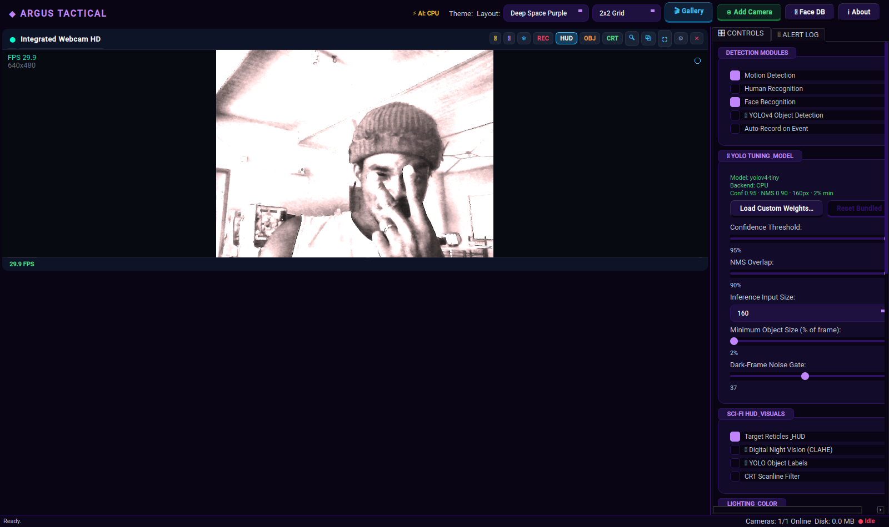

# Argus Tactical Vision Suite — C++/Qt6 Port

Native rewrite of the Python `surveillance_app` project (v1.3.0). Same features,
same semantics, but compiled C++20 with Qt6 Widgets and OpenCV (CUDA-capable).
Completely renamed/rebranded so it never collides with the installed Python
build (`sentinel-surveillance`): binary `argus`, window "Argus Tactical Vision
Suite", settings at `~/.config/argus/settings.json`, own icon.



Install the ready-made `.deb` from
[Releases](https://github.com/DjagbleyEmmanuel/argus-surveillance/releases):

```bash
sudo dpkg -i argus-1.3.0-Linux.deb
argus
```

## Class map (Python → C++)

| Python | C++ (this repo) | Thread | Notes |
|---|---|---|---|
| `CameraType` / `CameraStatus` | `core/camera.h` `enum class` | — | USB/RTSP/HTTP, status machine |
| `CameraSource` | `core/CameraSource` | capture thread | two-step `VideoCapture` open w/ timeouts; `usb_sys_name`/`usb_bus_path` identity; `detect_usb_cameras()` sequential v4l2-ctl probe; `resolve_usb_index()` stable re-connect |
| `MotionDetector` | `core::MotionDetector` | worker main loop | MOG2 + morphological cleanup + contours |
| `HumanDetector` | `core::HumanDetector` | HOG side-thread | HOG w/ cascade fallback |
| `ObjectDetector` (YOLOv4) | `core::ObjectDetector` | YOLO side-thread | CUDA backend, tuning (conf/nms/input/dark_gate) |
| `FaceRecognizer` | `core::FaceRecognizer` | face side-thread | LBPH + Haar, `recognize_faces()` |
| `Recorder` | `core::Recorder` | writer thread | pre/post buffers, codec fallback avc1→H264→mp4v→MJPG |
| `DetectionWorker` | `core::DetectionWorker` | main + 3 side | `QThread`-less plain `std::thread` pipeline |
| `DetectionResult` | `core::DetectionResult` | — | plain struct, moved (no per-frame copy) |
| `Settings` | `core::Settings` | — | JSON at `~/.config/argus/settings.json`, deep-merge |
| `CameraWidget` | `ui::CameraWidget` | GUI | `updateFrame()`, lighting/Night/scanlines/HUD, QSG-friendly paint |
| `AddCameraDialog` | `ui::AddCameraDialog` | GUI | exclude active indices, background `QThread` USB scan |
| `DetachedCameraWindow` | `ui::DetachedCameraWindow` | GUI | independent top-level window (never minimizes w/ main) |
| `MainWindow` | `ui::MainWindow` | GUI | owns cameras/workers/widgets, control panel, grid |
| `Theme` | `ui::Theme` | GUI | 5 themes (Cyberpunk Neon / Matrix Emerald / Obsidian OLED / Deep Space Purple / Stealth Red Alert), QSS builder |
| `RecordingsDialog` | `ui::RecordingsDialog` | GUI | tabs clips/snapshots, storage summary, delete/change-folder/open-folder |
| `MediaPlayerDialog` | `ui::MediaPlayerDialog` | GUI | QMediaPlayer/QVideoWidget playback + image viewer |
| `FaceManagerDialog` | `ui::FaceManagerDialog` | GUI | live preview, auto-capture, file enroll, delete, per-identity sample counts |
| `AboutDialog` | `ui::AboutDialog` | GUI | about/credits dialog |

## UI/UX surface

- **Header**: theme selector, grid layout (1/4/9/16), recordings gallery, add camera, face DB, about.
- **Per-camera card**: snapshot, night vision, freeze, record, HUD, object labels, CRT scanlines, zoom, popout, spotlight, settings, remove.
- **Collapsible per-camera settings**: resolution / FPS / pixel-format combos.
- **CONTROLS tab**: YOLO tuning (confidence/NMS/input/min-size/dark gate + custom weights), HUD toggles, lighting panel, master record/pause, motion sensitivity, poll rate, camera list.
- **ALERT LOG tab**: deduplicated (3 s) event stream.
- **Spotlight mode**: full-bleed focus camera + floating drawer handle.
- **VideoCanvas**: aspect-fit draw, lighting (convertScaleAbs / HSV / LUT), CLAHE night vision, tactical HUD boxes, object labels, CRT scanlines, eased zoom/pan, snapshot watermark.

## Threading model (must stay identical to Python)

```
                    ┌─────────────────────────────── GUI thread ──────────────┐
 CameraSource.read  │   MainWindow (owns all)                                  │
 (dedicated capture │    ├─ CameraWidget.updateFrame(result)  ← poll timer      │
  thread, pushes    │    ├─ grid/detached windows render                        │
  latest frame)     └───────────────────────────────────────────────────────────┘
        │  (cv::Mat shared_ptr, no deep copy)
        ▼
 DetectionWorker  (std::thread per camera)
   ├─ main loop: read_latest → motion (MOG2) → health → pack DetectionResult → queue(2)
   ├─ hog thread   (skips every 15 frames)
   ├─ yolo thread  (skips every 20 frames, CUDA)
   └─ face thread  (skips every 8 frames)
        │  (mutex-protected latest-boxes + frame handoff)
        ▼
 Recorder (std::thread)  ← pre-buffer, event-triggered H.264 clip
```

Key invariants preserved from the Python build:
- **V4L2 probing is sequential** and only from a worker thread (never blocks the GUI).
- **Two-step camera open** (`VideoCapture` then set open/read timeouts *before* `open()`).
- **Stable USB identity** via sysfs `name` + `/dev/v4l/by-path` so index changes don't break restores.
- **No re-add of a live camera** — a single capture handle per device on this OpenCV build.
- **Detached windows are parentless** `Qt::Window` so they survive main-window minimize.

## Build

```bash
cmake -S . -B /tmp/surv_cpp_build -GNinja -DCMAKE_BUILD_TYPE=Release
cmake --build /tmp/surv_cpp_build -j"$(nproc)"
# (CUDA enabled only if OpenCV was built with CUDA; system opencv4 is CPU-only)
```

Run from a directory containing `assets/models/` (yolov4.cfg/.weights, cascades).

## Status

- [x] Workspace + CMake + class map
- [x] core: camera (V4L2 probe, identity, two-step open, reconnects)
- [x] core: detector (Motion / Human / Problem)
- [x] core: object_detector (YOLOv4 CUDA + stability filter)
- [x] core: face_recognizer (LBPH + Haar) / recorder (event clips)
- [x] core: detection_worker (4-thread pipeline) / settings (JSON)
- [x] ui: widget / add-camera dialog / detached window / main window
- [x] ui: theme engine (5 themes), recordings / media player / face manager / about dialogs
- [x] ui: spotlight mode, per-camera settings panel, event log, YOLO tuning, lighting panel
- [x] Compiles (Qt6 6.4.2 + OpenCV 4.6) + smoke test + USB identity verified

## Verification notes (this machine)

- `cmake --build` clean; binary is **532 KB** (vs 1.4 GB PyInstaller bundle).
- Offscreen launch restores saved cameras from `~/.config/argus/settings.json`
  (same path/format as the Python app) and exits cleanly.
- `detectUsbCameras()` returns real sysfs names (`Integrated_Webcam_1.3M`, etc.)
  via sequential v4l2-ctl probes; `resolveUsbIndex()` maps a saved physical
  identity back to the current `/dev/videoN`.
- FaceRecognizer cascade / LBPH compile against system `opencv_face`.

## Live run (this machine)

- Launch: `setsid nohup ./argus > /tmp/argus_run.log 2>&1 &` from `/tmp/surv_cpp_build`.
- 3 USB cameras (`/dev/video0/2/4`) restore from saved settings with stable sysfs identity; all stream simultaneously.
- Settings persist on every change to `~/.config/argus/settings.json` (theme, grid_index, poll_rate, modules, yolo, visuals, lighting, cameras incl. per-camera fps/resolution/usb identity).
- Regression self-test: `./argus -platform offscreen --selftest-sliders` drives all four
  YOLO tuning sliders through their range and exits 0 on success.
